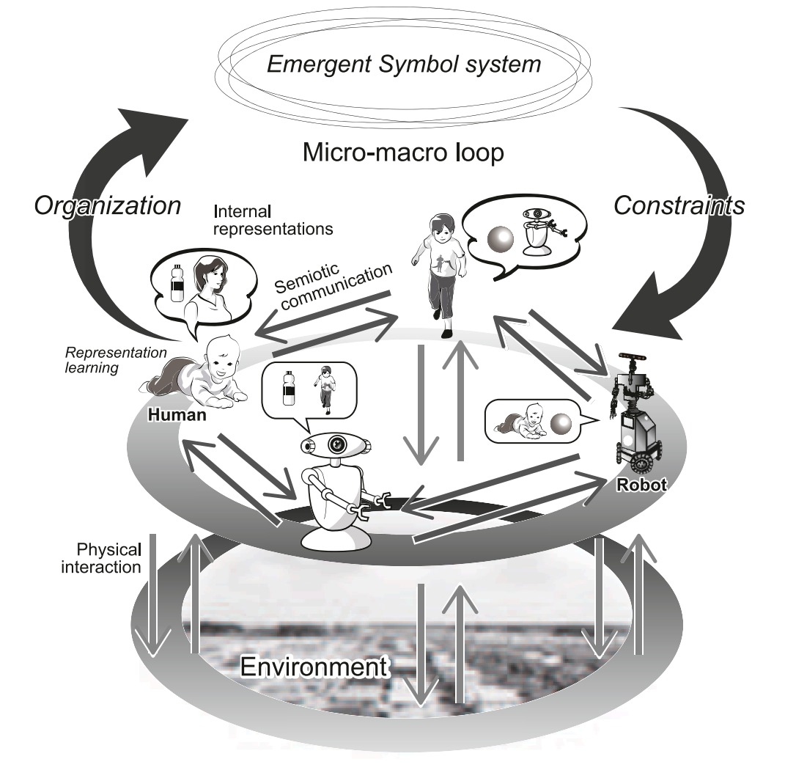

# 第1章　記号創発システムの考え方 {.unnumbered}

::: {.callout-note appearance="simple"}
**ステータス** — 執筆量: ⬛ 一通り執筆 ・ 検証: 🤖 AI出力のまま

この章はまだ著者による確認を受けていない。書かれていることをすべて未検証として扱ってほしい。
:::

::: {.callout-tip appearance="simple" title="この章の要約"}
言語をめぐる問いは、ふつう二つに分けて論じられる。ひとつは、個体がどうやって世界を捉え、意味を持つようになるのかという問いである。もうひとつは、社会がどうやって共通の言葉を持つのかという問いである。本書はこの二つを別々の問題として扱わない。個体が経験からつくる表現と、社会が共有する記号系とは、互いに相手をつくり変えながら動いている、ひとつの系である。この系を記号創発システムと呼ぶ。本章はその見方を導入し、以降のすべての章が守る二つの制約――他者の内側は覗けないこと、記号と経験は一対一に対応しないこと――を置く。
:::

## 二つの問いを一つの系として見る

台所で、母親が子どもにみかんを手渡している。子どもはそれを握り、皮の手ざわりを確かめ、口に入れる。前にも似たものを食べた。あのときも甘かった。子どもの中に、まだ名前のない「これ」のまとまりができていく。

しばらくして、母親が言う。「みかん、おいしいね」。

この場面には、性質の違う二つのことが同時に起きている。ひとつは、子どもが自分の感覚から「これ」のまとまり――カテゴリー――をつくっていく過程である。もうひとつは、そのまとまりに「みかん」という、周囲の人々が既に使っている音の並びが結びついていく過程である。

第一の過程だけを取り出せば、それは個体の学習の問題になる。視覚と触覚と味覚を統合して、世界を似たものごとに切り分ける。第二の過程だけを取り出せば、それは社会の慣習の問題になる。日本語という共同体が「みかん」という語を持っており、子どもはそれを覚える。

この二つを別々の問題として扱うのが、長いあいだの標準的なやり方だった。しかし、それでは説明できないことがある。**そもそも、その共同体はどこから「みかん」という語を手に入れたのか。**誰かが最初に決めたわけではない。辞書が先にあったわけでもない。語もその意味も、この母親と子どものような無数のやりとりの積み重ねから生じ、そして変わり続けてきたものである。

つまり、第二の過程は第一の過程の外側にある固定物ではない。社会の記号系は、個体たちの学習と相互作用から立ち上がってきたものである。そして、いったん立ち上がったそれは、こんどは新しく生まれてくる個体の学習を上から方向づける。子どもは「みかん」を自由に発明したのではなく、既にあるものを受け取った。

本書はこの往復を、ひとつの系として扱う。個体の認知のダイナミクスと、社会の記号系のダイナミクスとが、互いを条件としながら組織化されている系である。これを**記号創発システム**（symbol emergence system）と呼ぶ。

## 二つの経路

記号創発システムを読むうえで、まず押さえたいのは**二つの経路**である。図の上下方向に走る、向きの違う二本の矢印だと思ってよい。

{#fig-ses-loop fig-alt="記号創発システムの概念図。下段に環境、中段に人とロボットが並び、身体的相互作用と記号的コミュニケーションで結ばれ、上段の創発的記号系との間を組織化と制約の二つの大きな矢印が循環している"}

**ボトムアップの経路は、個体の表現学習である。**エージェントは身体を通して環境と関わり、感覚入力を受け取り、そこから内部の表現をつくる。みかんの色と手ざわりと味を統合して、ひとつのまとまりとして扱えるようにする。この経路が担っているのは、世界に接地することと、世界を予測できるようになることである。ここにはまだ他者が要らない。ひとりでも進む過程である。

**トップダウンの経路は、集団による記号創発である。**エージェントたちは記号を介してやりとりし、どの語がどのまとまりを指すかを、互いに調整していく。そして共有された記号系は、個体がどう世界を切り分けるかを制約する。日本語話者は「カラス」で足りるところを、英語話者は crow と raven に分ける。どちらが正しいという話ではない。所属する記号系が、その人の分節のしかたに効いているのである。

この二つは、どちらか一方が本質だという関係にはない。しかし、順番には意味がある。ボトムアップがなければ、記号は世界とつながらない。語と語の関係だけが閉じた環をつくり、何を指しているのかが決まらない。トップダウンがなければ、個体の表現は他者と噛み合わない。ひとりで整った世界の切り分けを持っていても、それを誰にも渡せない。

この二経路の見方は、問いの立て方そのものを変える。古典的な人工知能は、あらかじめ用意された記号に、あとから意味をどう結びつけるかを問うた。記号接地問題である。しかし、感覚運動の情報から出発して内部の表現がどう組織されるかを考えるなら、接地すべき宙に浮いた記号は初めから存在しない。問いは「与えられた記号をどう接地するか」ではなく、**「記号がどのように立ち上がり、共有され、維持されるか」**に置き換わる。筆者はこれを記号創発問題と呼び、本書の出発点としている。

第2章では、この二つの経路が数式のどこに現れるかを示す。ボトムアップは感覚入力から内部表現への部分に、トップダウンは共有される記号から内部表現への部分に対応する。つまり、上の図で上下に走る二本の矢印が、そのまま式の二つの因子になる。ここではまだ、そういう対応がつくということだけを予告しておく。

## マイクロ–マクロループ

二つの経路は、それぞれ独立に走っているのではない。閉じた輪をなしている。この輪を**マイクロ–マクロループ**（micro-macro loop）と呼ぶ。

自律分散系の言葉で言えば、こうなる。多数の要素とその相互作用から、質的に異なる上位の水準に、なんらかの秩序がボトムアップに組織される。これが自己組織化である。そして、その秩序が今度は下位の要素をトップダウンに制約したとき、系に新しい機能が生じる。これが創発特性である。

記号創発システムでは、ミクロの水準が個々のエージェントの認知ダイナミクスであり、マクロの水準が社会に共有された記号系である。新しい語を持ち出すことも、既存の語を別の意味で使うことも、私たちは自由にできる。その意味で、私たちは記号系をボトムアップに動かしている。しかし同時に、伝わってほしければ共同体の約束に従わなければならない。その意味で、私たちは記号系にトップダウンに縛られている。

新しい語が定着していく様子を見ると、この輪がそのまま観察できる。誰かが冗談まじりに使い始めた言い回しが、面白がられて真似され、狭い範囲で通じるようになる。ある時点を越えると、その語は「知らないと通じない語」に変わる。つくった側だったはずの人々が、いつのまにか従う側に回っている。ボトムアップの提案が、しばらく走ったあとでトップダウンの制約に変わったのである。

この構図は記号に固有のものではない。経済では、個々の取引から価格が立ち上がり、その価格が個々の取引を制約する。生物では、細胞が集まって個体をなし、個体の全体構造が細胞の活動を調整する。マイクロ–マクロループは、創発系一般の特徴である。本書が扱うのは、その一般的な構図が**記号**において実現している場合だ、と言ってもよい。

言語発達も、このループの内側で起きている。子どもがボトムアップに内部表現をつくる過程は、共同体――はじめは親――の記号系からのトップダウンの影響を、はじめから受けている。言語獲得は、自前の表現を組み上げる過程であると同時に、共同体の記号系を内側に取り込む過程でもある。

一方で、取り込まれる側の記号系も静止していない。語も、その使われ方も、意味も、社会の中で動き続けている。私たちは語を新しくつくり、既にある語を読み替える。この動きを止まったものとして扱わないために、本書ではこれを**創発的記号系**（emergent symbol system）と呼ぶ。ソシュール（Ferdinand de Saussure）の言うラング（langue）を、静的な体系としてではなく、維持され変化し続けるものとして捉え直したもの、と考えてよい。

つまり、記号創発システムは二階建ての動く系である。個体が動き、その集まりとして記号系が動き、動いた記号系がまた個体を動かす。この往復こそが本書の対象である。

## 二つの制約

ここまでの見方を、そのまま数理にすることはできない。何を仮定し、何を禁じるのかを決めなければならない。本書が置く制約は二つである。**この二つは、以降のすべての章が守る。**

### 作動的閉鎖

第一の制約は、**作動的閉鎖**（operational closure）である。あるエージェントは、他のエージェントの内部表現に一切アクセスできない。

母親は子どもの頭の中にある「これ」のまとまりを直接見ることができない。子どももまた、母親が「みかん」と言うときに母親の中で何が起きているかを覗けない。二人のあいだを行き来しているのは、音の並びと、目に見える振る舞いだけである。ロボットを二台並べても事情は同じで、内部の表現ベクトルを配線でつないでしまえば、それはもう二つのエージェントではない。

ここで用語をひとつ、はっきりさせておきたい。Preface で置いた**認知的閉鎖**（cognitive closure）は、各主体が自分の感覚運動系を通してしか世界に触れられないという条件だった。神の視点を使わない、という宣言である。いま述べている作動的閉鎖は、それとは**別の制約**である。こちらは、他者の内部状態を直接参照しない、というモデル側の禁止事項を指す。前者は世界に対する閉じ、後者は他者に対する閉じだと考えると区別しやすい。両者は関係が深いが、同じものではない。混ぜて使わないようにしたい。

作動的閉鎖は、一見すると理論を不自由にするだけの制約に見える。しかし本書では、これを**共有された記号系が要る理由**として読む。内側を見せ合えるなら、そもそも記号は要らない。見せ合えないからこそ、外に置いた記号を介して揃えるほかないのである。

つまり、この制約は理論の外から押しつけられた不便ではなく、説明したい現象そのものを成り立たせている条件である。制約を緩めればモデルは書きやすくなるが、書けたものは説明したかった対象ではなくなる。本書がこの制約を最後まで保つのは、そのためである。

### 記号の恣意性

第二の制約は、**恣意性**（arbitrariness）である。共有される記号と、個体の内部表現とは、一対一の可逆な対応にはならない。

恣意性には二つの層がある。ひとつは、記号の形と、それが指すものとの結びつきが約束にすぎないという層である。あの果物を「みかん」と呼ぶ必然性はなく、別の言語なら別の音になる。もうひとつは、切り分け方そのものが言語によって違うという層である。先ほどのカラスの例がこれにあたる。どこまでを同じものとして扱うかは、記号系の側の事情でも決まる。

したがって、記号と経験のあいだに辞書のような一対一の表を仮定することはできない。次元も型も揃っている必要はない。記号が離散的である必然性すらない。本書ではこの関係を、可逆写像ではなく、一般の確率的な関係として扱う。第2章でその形を与える。

しかし、恣意性を認めることは、何でもありを認めることではない。まったく勝手な名前を使えば、誰も応じてくれない。「ボトルを取って」と言うべきところで「ブラー」と言っても、水は出てこない。私たちは新しい語を提案する自由を持つが、他者に解釈されなければ記号的コミュニケーションの利得を受け取れない。だから、記号系の中で生き延びる語は、提案されたもの全体のごく一部である。**恣意性は、共有されることによって抑えられている。**この抑えの働きこそが、マクロからの制約に他ならない。

つまり、二つの制約は別々に置かれた仮定ではない。内側を見せ合えないから記号が要り、記号が恣意的だから揃える働きが要る。二つは一つの問題の表と裏である。

## 第2章へ

二つの経路と、二つの制約が出そろった。では、これらをどのような数理として書けばよいのか。

要求は厳しい。書こうとしているモデルは、個体の表現学習と集団の記号創発を同時に含まなければならない。他者の内部表現を参照してはならない。記号と経験のあいだに一対一の対応を置いてもならない。それでいて、共有される記号系が立ち上がる仕組みを説明しなければならない。

第2章では、この要求を満たす形を与える。ひとつの生成モデルと、そこから導かれる事後分布である。二つの経路がその式のどこにあるかも、そこで示す。
