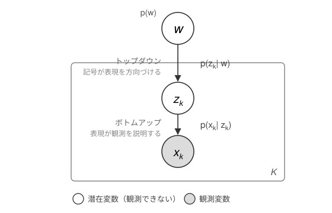

# 第2章　数理の導入 {.unnumbered}

::: {.callout-note appearance="simple"}
**ステータス** — 執筆量: ⬛ 一通り執筆 ・ 検証: 🤖 AI出力のまま

この章はまだ著者による確認を受けていない。書かれていることをすべて未検証として扱ってほしい。
:::

::: {.callout-tip appearance="simple" title="この章の要約"}
台所でみかんを受け取った子どもの経験は、その子だけのものである。母親はそれを覗けない。それでも「みかん」という語は二人のあいだで働き、しかもその語は、子どもがこれから世界をどう切り分けるかを方向づけていく。第1章では、この往復を二つの経路として述べた。本章はそれを確率モデルとして書く。ひとつの生成過程を置き、そこから、集団全体の経験を与えられたときに共有される記号がどうなっていそうかを表す分布を導く。導かれた分布は、各人が持ち寄った証拠の積の形をとる。多数決でも平均でもなく、積である。この形が何を意味するかまでが本章の範囲であり、その分布を誰がどう計算するのかは次章以降に送る。
:::

## 記法を定める

本書全体で使う記号を、ここで固定する。以降の章で記法を拡張する場合も、この四つからの差分として導入する。

エージェントを $k = 1, \ldots, K$ で添字づける。$K$ はエージェントの数である。第1章の台所の場面なら、母親と子どもの二人で $K = 2$ となる。

各エージェント $k$ について、次の三つを置く。

- $x_k$：エージェント $k$ の**観測**である。自分の感覚器から入ってくるもの、と考えてよい。みかんの色、手ざわり、味がここに入る。他のエージェントはこれを直接見られない。
- $z_k$：エージェント $k$ の**内部表現**である。観測から自分の内側につくる表現であり、第1章で「まだ名前のない『これ』のまとまり」と呼んだものにあたる。これも他者からは観測できない。
- $w$：エージェントたちのあいだで**共有される記号**である。語や記号系がこれにあたる。$z_k$ と違い、$w$ は個体の内側にはない。

添字のない $w$ が一つだけであることに注意したい。$z_k$ は人数ぶんあるが、$w$ は集団に一つである。この非対称性が、本章の議論の全体を決める。

なお、$w$ が離散的である必要はない。語のような離散的なものを思い浮かべてよいが、モデルの側は連続的な $w$ も許す。第15章で連続空間の場合を扱う。

## 二つの経路を数理に写す

第1章では二つの経路を置いた。個体が観測から内部表現をつくり世界を予測する経路と、共有される記号が個体の内部表現を方向づける経路である。この二つを、ひとつの生成過程として書く。

生成モデルとは、観測がどのように生じたかについての仮説を、確率分布の形で書いたものである。本書が置く生成モデルは次の形をとる。

$$
p(w) \prod_{k=1}^{K} p(z_k \mid w)\, p(x_k \mid z_k)
$$ {#eq-generative}

この式は、次の順序でものごとが生じたと述べている。まず共有される記号 $w$ があり、それが各エージェントの内部表現 $z_k$ を生み、その内部表現が観測 $x_k$ を生む。三つの因子はそれぞれ次の意味を持つ。

- $p(x_k \mid z_k)$：内部表現が観測を説明する部分である。第1章のボトムアップの経路――接地と予測の側――がここにある。エージェント $k$ が自分の $z_k$ をよくすることは、自分の $x_k$ をよく予測できるようになることである。
- $p(z_k \mid w)$：共有される記号が内部表現を方向づける部分である。第1章のトップダウンの経路がここにある。日本語話者と英語話者でカラスの切り分けが違うのは、この因子が違うからだと読める。
- $p(w)$：共有される記号そのものについての事前の仮定である。どんな記号系がありそうかについての、観測を見る前の見込みを表す。

::: {.column-page-inset}
{#fig-pgm fig-alt="共有表現 w から各エージェントの内部表現 z_k が生成され、そこから観測 x_k が生成されるグラフィカルモデル。z_k と x_k は K 個のエージェントを表すプレートで囲まれている" width="78%"}
:::

つまり、[@eq-generative] の一本の式に、第1章の二つの経路が上下に並んで入っている。矢印の向きは $w$ から $x_k$ へ下るが、これは生成の向きであって、私たちが知りたいことの向きではない。実際に手元にあるのは観測 $x_k$ のほうであり、知りたいのは $w$ である。向きを逆にたどる作業がこの先に要る。

なお、各因子を具体的にどのような確率分布や神経回路として書くかは、ここでは決めない。第II部で個体の確率的生成モデルや償却推論として読み直す。本章で必要なのは、因子の形だけである。

## 仮定から因子分解へ

なぜ [@eq-generative] のように積の形に書けるのか。ここが飛躍しやすいところなので、仮定から順に確かめる。

**第一の仮定は、各エージェントが自分の観測しか持たないことである。**エージェント $k$ が手にしているのは $x_k$ だけであり、他のエージェント $j$ の内部表現 $z_j$ を直接には参照できない。これが第1章で置いた作動的閉鎖である。ここで、Preface の認知的閉鎖と混ぜないようにしたい。あちらは世界に対する閉じであり、こちらは他者に対する閉じであった。いま数理の制約として使うのは後者である。

**第二の仮定は、それでも全エージェントが $w$ を介して結ばれていることである。**互いの内側は覗けないが、共有された記号だけは全員に届く。$w$ が集団に一つしかないという先ほどの非対称性は、この仮定を表している。

**第三の仮定が、本章の技術的な要である。**$w$ を固定したとき、各エージェントの生成過程は互いに条件付き独立になる、と仮定する。言い換えれば、共有される記号が決まってしまえば、ある人の内部表現と別の人の内部表現とのあいだに、それ以上の直接の依存はない。二人が似た概念を持つとしたら、それは同じ言語を共有しているからであって、頭がつながっているからではない。

この第三の仮定を置くと、同時分布が積に分解する。エージェントごとの因子 $p(z_k \mid w)\, p(x_k \mid z_k)$ が $k$ について掛け合わされ、その前に $p(w)$ が掛かる。[@eq-generative] はこうして得られる。

つまり、積の形は計算の便宜として持ち込まれたものではない。互いの内側を覗けないという条件を、確率モデルの言葉に翻訳した結果である。条件付き独立性は、作動的閉鎖の数理的な姿だと考えてよい。

## 集合事後分布

生成の向きが書けたので、逆にたどる。集団全体の観測が与えられたとき、共有される記号はどうなっていそうか。これを表す分布を求めたい。

$K$ 人ぶんの観測をまとめて $x_{1:K} = (x_1, \ldots, x_K)$ と書く。求めたいのは $P(w \mid x_{1:K})$ である。ベイズ則により、これは同時分布を $w$ 以外の変数について周辺化したものに比例する。各エージェントの $z_k$ を積分して消すと、次の形になる。

$$
P(w \mid x_{1:K}) \;\propto\; p(w) \prod_{k=1}^{K} \int p(x_k \mid z_k)\, p(z_k \mid w)\, \mathrm{d}z_k
$$ {#eq-collective-posterior}

この式は、集団全体の経験を与えられたときに、共有される記号がどうなっていそうかを述べている。本書ではこれを**集合事後分布**（collective posterior distribution）と呼ぶ。

積分の中身を見ておきたい。$\int p(x_k \mid z_k)\, p(z_k \mid w)\, \mathrm{d}z_k$ は、$w$ を仮に決めたときに、エージェント $k$ の観測 $x_k$ がどれくらい出てきやすいかを表している。エージェント $k$ の内部表現 $z_k$ は、この積分によって消えている。消えていることが重要である。最終的な式に他者の内部表現が残っていないので、この分布は作動的閉鎖と矛盾しない。

$z_k$ が離散的な場合は、積分の代わりに和をとればよい。式の意味は変わらない。連続と離散の扱いの違いが効いてくるのは後の章であり、ここでは同じものとして進む。

## 専門家の積として読む

[@eq-collective-posterior] の右辺は、$k$ についての積である。この形が何を意味するのかを、ここで押さえておきたい。

各エージェントは、自分の観測から見て「共有される記号はこうであってほしい」という見込みを持つ。それが積分で書かれた各因子である。集合事後分布は、それらを掛け合わせたものに比例する。このような形を**専門家の積**（Product of Experts; PoE）と呼ぶ。それぞれのエージェントが、自分の観測という限られた専門領域について意見を述べる専門家だ、という見立てである。

掛け算であることは、足し算や平均とは違う。もし平均をとるなら、一人が強く否定してもほかの多数が支持すれば通ってしまう。積ではそうならない。ある候補について、誰か一人の因子がほぼ零を返せば、他の全員が高い値を返しても、積は零に近くなる。つまり、全員の観測と両立する記号だけが強く残る。多数決ではなく、全員の拒否権に近い。

第1章の例に戻せば、こうなる。母親の経験から見て「みかん」がまったくありえない語であれば、子どもがどれだけその語を使っても、二人のあいだの記号としては定着しない。逆に、双方の経験と噛み合う語は、繰り返しのやりとりの中で残っていく。積の形は、この選別の働きを表している。

そして、この積こそが第1章のボトムアップの経路である。個々人の経験が、共有される記号を下から形づくる。[@eq-generative] では $w$ から下へ矢印が伸びていたが、[@eq-collective-posterior] では観測の側から $w$ が決まっていく。同じひとつのモデルを、生成の向きと推論の向きの両方から見ている、ということである。

## 第3章へ

ここまでで、第1章の二つの経路が式の形になった。生成モデルがあり、そこから集合事後分布が導かれ、その分布は各エージェントの証拠の積であった。

しかし、大きな問いが残っている。この分布を、誰が計算するのか。

[@eq-collective-posterior] を書き下すには、全員ぶんの因子を一箇所に集めて掛け合わせる必要がある。それができるのは、全エージェントの内部を覗ける立場の者だけである。そのような立場は、第1章で置いた作動的閉鎖のもとでは存在しない。神の視点を使わないと決めた以上、この式を上から計算する主体はどこにもいないのである。

では、この共有表現を、エージェントたちはどのようなやりとりで揃えるのか。第3章では、内部表現を互いに渡さないまま、この集合事後分布に向かって進む手続きを、ゲームの形で導入する。第3章の時点では手続きの直観だけを渡し、それが本当に正しい推論になっていることの根拠は、第II部と第III部で与える。

## 要判断

- 本章では $p(w)$ を「事前の仮定」とだけ述べ、その中身に立ち入っていない。記号系の事前分布に何を置くかは、初版でどこまで書くか未定である。
- 専門家の積の正規化については、比例関係のみを扱い、正規化定数の存在条件に触れていない。厳密な条件づけが要るなら、付録での注記が要る。
