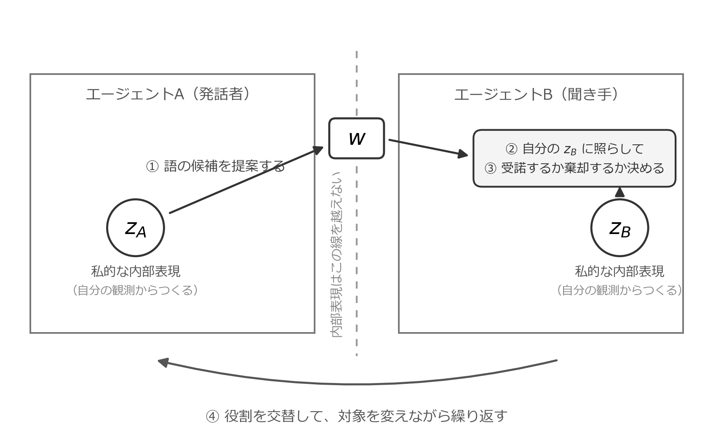

# 第3章　Metropolis–Hastings 名付けゲームの考え方 {.unnumbered}

::: {.callout-note appearance="simple"}
**ステータス** — 執筆量: ⬛ 一通り執筆 ・ 検証: 🤖 AI出力のまま

この章はまだ著者による確認を受けていない。書かれていることをすべて未検証として扱ってほしい。
:::

::: {.callout-tip appearance="simple" title="この章の要約"}
第2章は、集合事後分布を誰が計算するのか、という問いを残して終わった。全員の内側を覗ける立場は、本書では認めない。本章はその問いに、ゲームの形で答えを渡す。二人が同じ対象を見ている。一方が語を言い、もう一方が自分の経験に照らして、その語を受け入れるか決める。受け入れれば語が変わり、受け入れなければ変わらない。役割を交替しながら、これを繰り返すだけである。境界を越えるのは語だけであり、内側の表現は誰にも渡らない。それでも、この繰り返しは集団全体の推論として働く。本章が渡すのはこのゲームの姿だけで、なぜそれが推論として正しいのかは、部品のそろう第II部と第III部で答える。ここでは完全にわからなくてよい。
:::

## 私的な表現と、共有される語

第1章の台所に戻る。母親と子どもが、同じみかんを見ている。二人とも、そのみかんから何かを受け取り、自分の内側にまとまりをつくっている。しかし、そのまとまりが二人で同じである保証は、どこにもない。母親は長年みかんを食べてきた経験の上に、子どもはまだ数回の経験の上に、それぞれのまとまりを置いている。粒度も、他の果物との境目の引き方も、揃っているとは限らない。

記法を、二人の場合に書き直しておく。第2章ではエージェント $k$ の内部表現を $z_k$ と書いた。以下では $K = 2$ とし、二人の内部表現を $z_A$、$z_B$ と書く。添字を $A$、$B$ に置き換えただけであり、新しい変数を導入したわけではない。共有される記号 $w$ は、第2章と同じく集団に一つである。

では、二人はどうやって揃えるのか。もっとも素朴な答えは、内部表現をそのまま渡すことである。母親が $z_A$ を送り、子どもが自分の $z_B$ をそれで置き換える。これで二人は一致する。しかし、この答えは使えない。第1章の作動的閉鎖を破っているからである。内側を配線でつないでしまえば、それはもう二つのエージェントではない。

交換できるものは、はじめから限られている。音の並び、書かれた記号、そしてそれに対する相手の反応――外に出せるものだけである。第2章の記法では、それが $w$ にあたる。$z$ は私的であり、$w$ は共有の候補である。この対比が、本章のあいだずっと効き続ける。

つまり、本章の問いはこうなる。私的なものを一切渡さずに、共有されるものだけを揃えることはできるのか。

## 名付けゲームの一巡

答えは、ゲームの形で与えられる。**メトロポリス–ヘイスティングス名付けゲーム**（Metropolis-Hastings naming game; MHNG）である[^mhng-ref]。まず、素朴な手順として述べる。

[^mhng-ref]: 本章が主として参照するのは [@Taniguchi2023MHNG] である。本章では、その論文が扱っている内容のうち、ゲームとしての手順だけを取り出している。受諾の確率がどのような形をとるか、深層生成モデルを使うと何ができるようになるかは、第III部で改めて扱う。

場面を決める。二人のエージェントが、同じ対象に同時に注意を向けている。これを**共同注意**（joint attention）と呼ぶ。ヒトの発達では生後9か月ごろに現れ、語彙の獲得を支える基盤になるとされる。以下では、この状況が成り立っているものとして話を進める。つまり、二人が別々のものを見ていて、どれについて話しているのかがそもそも分からない、という問題は、ここでは扱わない。

この状況で、次の一巡が回る。

1. 一方が発話者になり、もう一方が聞き手になる。
2. 発話者は、自分の内部表現に基づいて、その対象を指す語の候補をひとつ選ぶ。決め打ちではなく、自分の内側から見てもっともらしい語を確率的に選ぶ。これが「名付け」にあたる。
3. 聞き手は、その語を受け取る。受け取るのは語だけである。発話者の内部表現は届かない。
4. 聞き手は、その語が自分の経験に照らしてしっくりくるかを見る。いま自分がその対象に当てている語と、提案された語とを比べ、提案のほうがしっくりくるなら受け入れやすく、そうでないなら受け入れにくい。判断は確定的ではなく、確率的である。
5. 受諾すれば、その対象に当てる語は提案されたものに変わる。棄却すれば、元の語のままである。
6. 対象を変えながら同じことを行い、ひととおり終わったら、聞き手は自分の内部表現と、語と表現の結びつけ方を、自分の内側で更新する。
7. 役割を交替し、以上を繰り返す。

{#fig-mhng-loop fig-alt="左にエージェントA（発話者）、右にエージェントB（聞き手）が並び、それぞれの内部表現 z_A と z_B が枠の中に置かれている。中央の破線を越えるのは語 w だけで、Bは自分の z_B に照らして受諾か棄却かを決める。下部の矢印が役割交替を示す" width="92%"}

いくつか、取り違えやすいところに注を付けておきたい。

第一に、受諾の判断は、正解ラベルとの一致で下されるのではない。このゲームには、正しい語を知っていて教えてくれる者がいない。手順4の「しっくりくる」は、外から与えられた正解との照合ではなく、聞き手自身の内部表現との噛み合いを指している。

第二に、発話者は聞き手の内部状態を書き換えられない。発話者にできるのは、語をひとつ差し出すことだけである。それを採るかどうかは、最後まで聞き手の側にある。

第三に、聞き手が判断に使う情報は、自分の内部表現と、いま提案された語だけである。全体の集計も、他の誰かの意見も参照しない。判断は局所的である。

第四に、受諾するかどうかを決める確率の具体的な形は、本章では書かない。その形こそがこのゲームの要なのだが、書き下すには第II部の道具が要る。

つまり、このゲームには、正解も、審判も、中央の集計者もいない。あるのは、提案と、自分の内側だけで測る判断と、交替だけである。

## 内側は渡らない

このゲームで実際に境界を越えているものを数え上げてみると、語の候補ひとつしかない。[@fig-mhng-loop] の破線を越えるのは $w$ だけであり、$z_A$ は A の内側に、$z_B$ は B の内側にとどまる。

ここで、やりとりする情報が少なくて済む、という話をしているのではない。仮に $z_A$ を送る帯域がいくらでもあったとしても、送ってはならない。第1章で置いた作動的閉鎖は、量の制約ではなく種類の制約だからである。他者の内部表現を直接読み書きしない、というモデル上の禁止であって、通信路の細さの話ではない。

用語の区別を、ここでもう一度確認しておきたい。Preface で置いた認知的閉鎖は、どの主体も自分の感覚運動系を通してしか世界に触れられない、という前提であった。世界に対する閉じである。いま守られているのは作動的閉鎖のほうで、こちらは他者の内部表現を直接参照しないという、モデルの側の制約である。二つは関係が深いが、同じものではない。

それでも、集団の水準では何かが揃っていく。各自は自分の内側だけを見て判断しているのに、繰り返しのあいだに、二人が同じ対象に同じ語を当てるようになる。しかも残る語は、どちらか一方の内部表現だけを映したものではない。一方にとってどれほどしっくりくる語でも、他方が受け入れなければ定着しない。第2章で見た専門家の積の働きが、ここに顔を出している。

つまり、作動的閉鎖は、共有される記号が立ち上がることの妨げになっていない。第1章で述べたとおり、内側を見せ合えないからこそ外に置いた記号が要るのであり、このゲームはその要請に具体的な形を与えたものである。

## なぜこれがベイズ推論になるのか

ここまでの説明だけなら、これは工夫されたやりとりの規則にすぎない。しっくりくれば受け入れる、という手続きは直観的ではあるが、なぜそれでよいのかを何も言っていない。会話を続ければいつかは合意できるだろう、という一般論とも区別がつかない。

区別がつくのは、受諾するかどうかを決める確率を、設計者が好きに決めてよいわけではないからである。この確率には、満たすべき形がある。その形を使ったとき、このゲームの繰り返しは、第2章で導いた集合事後分布 $P(w \mid x_{1:K})$ からのサンプリングになる。局所的なやりとりの反復が、集団の観測すべてを踏まえた推論を実行していることになる。

名前の由来も、そこにある。**メトロポリス–ヘイスティングス法**（Metropolis-Hastings algorithm; MH 法）は、目標とする分布から直接サンプルを取れないときに、候補の提案と受諾／棄却を繰り返すことで、その分布からのサンプルを得る手法である。マルコフ連鎖モンテカルロ法の代表例として古くから知られている。名付けゲームの発話が MH 法の提案に、聞き手の判断が MH 法の受諾に対応する。二人のやりとりの記述が、そのまま推論のアルゴリズムの記述になっている。これがこのゲームの名前の意味である。

つまり、私たちはこの過程を、会話として読むことも、推論として読むこともできる。同じ一つの過程の、二つの読み方である。第2章の終わりに置いた問い――集合事後分布を誰が計算するのか――への答えは、誰も計算しない、になる。中央で式を書き下す主体はどこにもいない。それでも、やりとりの繰り返しが計算の役目を果たす。本書ではこれを**分散型ベイズ推論**（decentralized Bayesian inference）と呼ぶ。

ただし、ここまでが予告である。受諾の確率がどのような形をとるのか、なぜその形にすると集合事後分布に行き着くのかは、本章では示さない。示すのに必要な部品がまだそろっていないからである。第III部第8章で改めて扱う。

## この考え方の来歴

MHNG は、ある日いきなり現れた手法ではない。短い経緯を書いておく。

出発点は、二体のエージェントが記号を共有しながら、同時にそれぞれのカテゴリー化も進められることを示した研究である。萩原（Yoshinobu Hagiwara）らは2019年に、これを確率モデルの上で成り立たせた [@Hagiwara2019]。筆者らは2022年に、この枠組みを視覚・聴覚・触覚の複数のモダリティへ広げている [@Hagiwara2022]。

本章が主として参照する2023年の研究は、この線の上にある。筆者らはそこで、内部表現の学習を深層生成モデルに任せた。あらかじめ整えられた特徴からではなく、生の画像から出発しても、同じゲームが働く [@Taniguchi2023MHNG]。

つまり、この考え方は、記号の共有を扱う具体的なモデルを積み上げていく過程で見つかったものである。先に理論があって応用が続いたのではなく、動くモデルの側から、それが分散型ベイズ推論になっているという読み方が現れた。

## 第II部へ

第I部は、考え方、数理、ゲームの直観の順に進んできた。三つはそろった。

しかし、まだ書けていないことがある。

> 発話者と聞き手は、それぞれ何を内部表現として持ち、提案された語をどのような確率モデルで評価するのか。

この問いに答えるには、部品が要る。個体が観測から内部表現をつくる過程を、確率的生成モデルとして書けること。その推論を、実際に計算できる形にすること。複数の個体のモデルを、共有される記号でつなぐ書き方を持つこと。第II部では、これらを順に導入する。

部品がそろったところで、私たちは第III部で本章のゲームに戻る。そこでは受諾の確率を具体的に書き下し、それが集合事後分布からのサンプリングになっていることを示す。本章で預けたものは、そこで返す。

## 要判断

- 訳語対照表は decentralized Bayesian inference の訳を「分散的ベイズ推論」としているが、第I部の部タイトルと `index.qmd` は「分散型ベイズ推論」である。本章は部タイトルに合わせて「分散型」を使った。どちらかに寄せる必要がある。
- 本章の一巡には、受諾／棄却を一巡ぶん終えたあとに聞き手が自分の内部表現を更新する段階（手順6）を含めた。主参照のアルゴリズムに含まれる段階であり、第1章のトップダウンの経路が現れる箇所でもあるため入れたが、第I部の範囲としては踏み込みすぎかもしれない。
