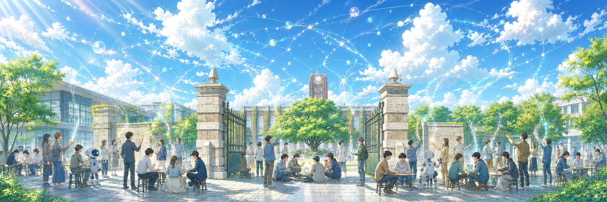
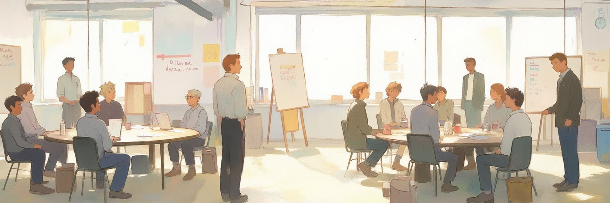

::: {.banner-fade}

:::

::: {.callout-important title="本書は作成中です。ベータ版ですらありません。"}
このサイトは**まだ存在しない公開ドラフトの置き場**です。本文はほとんど書かれていません。いま見えるのは計画——本書のねらい・構成・中核となる定式化——です。

**このサイトの内容の引用・転載はお控えください。**文言・記法・章番号・目次はすべて変わる見込みです。引用可能な版ができたときに DOI を付与し、この注意書きを差し替えます。

**This public draft is written in Japanese first; an English edition will follow as a
translation.** Please do not cite, quote, or redistribute anything from this site.
:::

## 本書について

本書は、集合的予測符号化（Collective Predictive Coding; CPC）を**記号創発システムの数理理論**として体系化する教科書である。ねらいは三つある。

1. CPC を記号創発システムの理論として数理的に体系化する。
2. 個別論文に散っている定式化を、**単一の生成モデル**からの積み上げとして統合する。
3. ロボティクスを超えて——CPC-MS や、より広い記号システム・知性の基盤理論としても手に取られる本にする。

### 想定読者

- **理論と実装を学ぶ読者**: 情報学・認知科学・ロボティクスの大学院生、研究者、意欲的な学部生、社会人
- **人文社会系から理論を学ぶ読者**: 言語学・人類学・社会学・科学論・経済学などで、記号・知識・制度・社会的相互作用を数理的に考えたい学生と研究者
- **AIエージェントを構築する読者**: 世界モデル、他者とのコミュニケーション、共有知識、協調行動を備えた AI Agent を設計・実装したい開発者と実践者

数理を通読するための下限は変分ベイズとマルコフ連鎖モンテカルロ法の基礎である。これらに初めて触れる意欲的な学部生・社会人・人文社会系の読者も、読み筋と付録を足場として本書に入れるよう設計する。

## 目次（全31章）

**Preface**

- 人類の知能、認知的閉鎖と恣意的な記号

**第I部　記号創発システムと分散型ベイズ推論**

- 第1章　記号創発システムの考え方
- 第2章　数理の導入
- 第3章　Metropolis–Hastings 名付けゲームの考え方

**第II部　確率的生成モデルとグラウンディング**

- 第4章　個体の確率的生成モデル
- 第5章　確率的生成モデルと VAE
- 第6章　Inter-PGM ファミリー
- 第7章　SERKET / Neuro-SERKET：要素 PGM の統合
- 第8章　予測符号化（脳科学）と自由エネルギー原理
- 第9章　世界モデル
- 第10章　能動的推論と Control as Inference

**第III部　推論アルゴリズム＝言語ゲーム**

- 第11章　Metropolis–Hastings 名付けゲーム
- 第12章　一般化と再帰的 MHNG
- 第13章　共同注意名付けゲーム
- 第14章　変分ベイズ名付けゲーム
- 第15章　連続空間・ガウス過程と離散性の創発

**第IV部　集合的自由エネルギー**

- 第16章　集合的自由エネルギー

**CPC 推論の力学系**

- 第17章　名付けゲームの力学系
- 第18章　系列 CPC

**第V部　行動とマルチエージェント**

- 第19章　Generative EmCom と集合的世界モデル仮説
- 第20章　MARL-CPC
- 第21章　分散型集合世界モデルと協調
- 第22章　ロボットの認知アーキテクチャと集合的予測符号化

**System 0/1/2/3（層と時間尺度）**

- 第23章　System 0/1/2/3

**感情（内受容と共有される感情語彙）**

- 第24章　感情：内受容感覚と共有される感情語彙

**表象・クオリア構造・心の哲学**

- 第25章　表象・クオリア構造・心の哲学

**構成論の背景と科学哲学**

- 第26章　構成論の背景と科学哲学

**CPC-MS（メタサイエンス／生成科学）**

- 第27章　メタサイエンスとしての集合的予測符号化
- 第28章　生成科学

**Human-AI Alignment and Society**

- 第29章　人間–AI アライメントと社会

**第VI部　経済学**

- 第30章　経済学の準備：価格メカニズムと双対分解
- 儀礼　※章として持つかは未決

**第VII部　Open Challenges & Questions**

- 第31章　開かれた挑戦と問い

**付録**

- 付録A　変分推論
- 付録B　MCMC
- 付録C　記法一覧
- 付録D　用語対応表（人文社会系↔数理）
- 付録E　論文ガイド：何から読むか

## 執筆言語について

本書は**日本語を正本（single source of truth）**として執筆し、英語版は日本語本文からの訳として作成する。Springer からの出版時には英語版が書籍となる。日英で内容が食い違う場合は日本語が正しい。

## 進捗の表示

執筆量と検証は**別々の軸**で表示する。AI を使うと執筆量だけが先行しうるため、一つの進捗率に混ぜない。

**執筆量** — ⬜ 未着手 / ◽ 骨子のみ / ◨ 部分執筆 / ⬛ 一通り執筆

**検証** — 🤖 AI出力のまま（*内容の正しさを一切保証しない*） / 👀 目視確認済 / ✅ 著者検証済

::: {.callout-warning title="現在のステータス"}
**ほぼ全章が ⬜〜◽ かつ 🤖 です。**このサイトの内容はまだ著者による検証を受けていません。章ごとのステータスは執筆の進行に応じて付けていきます。
:::

## コメント・修正提案

誤字・数式の誤りの指摘、内容への提案を歓迎します。**日本語・英語どちらでも**受け付けます。

- **Issue を立てる:** <https://github.com/tanichu/cpc-textbook/issues>

簡単な取り決め：

- 寄せられた指摘・提案を出版される書籍に反映する権利は著者が持ちます（対価・共著権は生じません）。
- 貢献者は謝辞に記載します。

章ごとのスレッド議論・インライン注釈・匿名フォームなどの追加チャンネルは検討中で、まだ用意されていません。

## ライセンス

**未定です。**ライセンスを告知するまでは全権利を留保します——再配布・二次利用はお控えください。Springer からの出版と衝突しないライセンスを選ぶ予定です。

## 引用について

**まだ引用しないでください。**引用に耐える安定した内容はここにはありません。引用可能なドラフトを公開する際に DOI を発行します。
